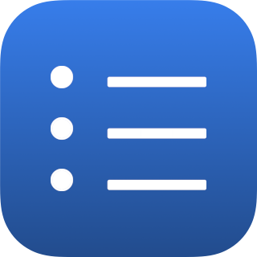

 
  
  
  
  <h1 align="center">ToDo</h1>  
  

    ToDo is a simple app that helps you keep track of tasks.
  

## Features
- Keep track of tasks with to-do lists

- Mark to-dos as completed when you're done

 

- Create reminders

 

- Organize items using lists

 

- Keep track of tasks on iPadOS or Macs with Apple Silicon

 

## Requirements
- iOS 15+
- iPadOS 15+

## License

Distributed under the GPLv3 license. See `LICENSE.md` for more information.
